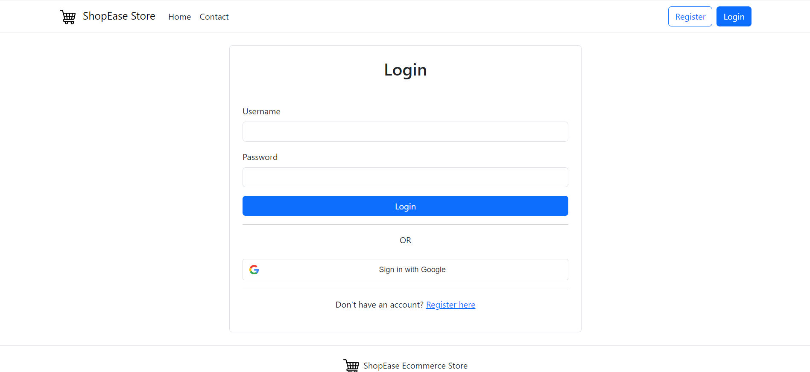

# React Ease Shop



Welcome to **React Ease Shop**, an e-commerce platform built with React, SWR, Axios, Zustand, and the Fake Store API. This application offers a seamless shopping experience with features such as product listing, user authentication, cart management, and order tracking.

## 🌟 Features

- **Product Management:** Browse and manage a wide range of products.
- **User Authentication:** Secure login and registration, including Google Authentication.
- **Cart Functionality:** Add, remove, and manage products in your cart.
- **Order Tracking:** Keep track of your orders.
- **Responsive Design:** Optimized for various screen sizes.
- **Admin Panel:** Manage products, users, and orders with ease.

## 🚀 Getting Started

Follow these steps to set up the project locally.

### Prerequisites

- Node.js (v12 or higher)
- npm or yarn

### Installation

1. Clone the repository:

    ```sh
    git clone https://github.com/iMamoonAkhter/react-easeshop.git
    ```

2. Navigate to the project directory:

    ```sh
    cd react-easeshop
    ```

3. Install dependencies:

    ```sh
    npm install
    ```

    or

    ```sh
    yarn install
    ```

### Running the Application

1. Start the development server:

    ```sh
    npm start
    ```

    or

    ```sh
    yarn start
    ```

2. Open your browser and go to:

    ```
    http://localhost:3000
    ```

## 🛠️ Technologies Used

- **React**: A JavaScript library for building user interfaces.
- **SWR**: React Hooks library for data fetching.
- **Axios**: Promise-based HTTP client for the browser and Node.js.
- **Zustand**: A small, fast, and scalable bearbones state management solution.
- **Bootstrap**: For responsive design and styling.
- **Fake Store API**: For simulating product data.
- **Google Authentication**: For secure and easy user authentication.


## 🧑‍💻 Contributing

We welcome contributions! Follow these steps to contribute:

1. Fork the repository.
2. Create a new branch (`git checkout -b feature-branch`).
3. Make your changes.
4. Commit your changes (`git commit -m 'Add new feature'`).
5. Push to the branch (`git push origin feature-branch`).
6. Open a pull request.

## 📝 License

This project is licensed under the MIT License.


[](https://github.com/iMamoonAkhter/react-easeshop)

---

Thank you for visiting **React Ease Shop**! Happy shopping! 🛍️
